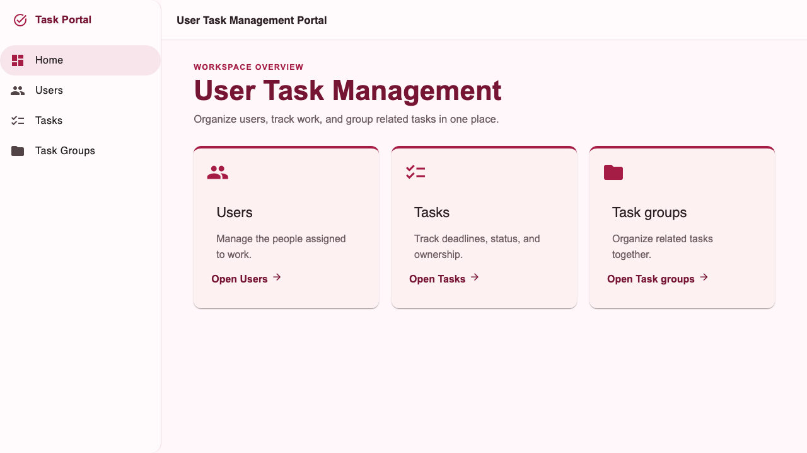
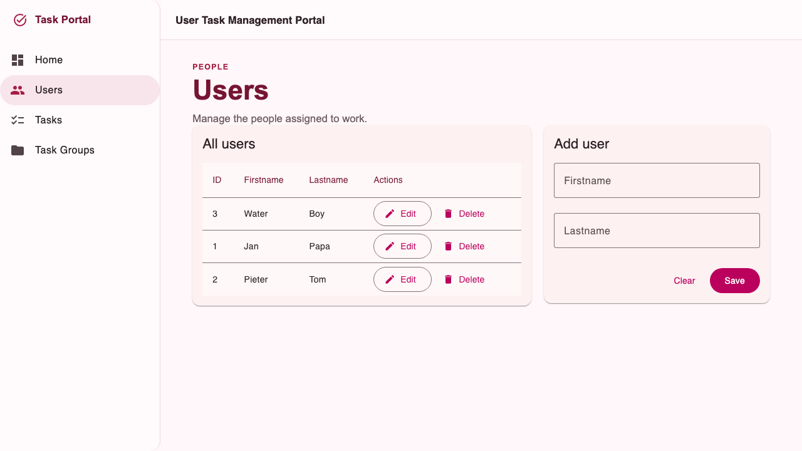
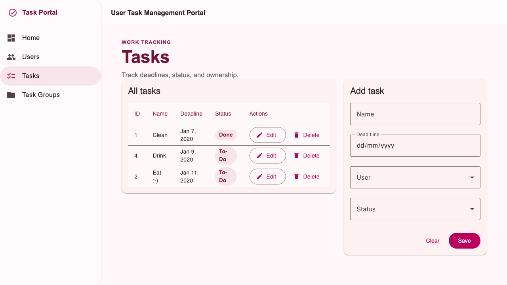
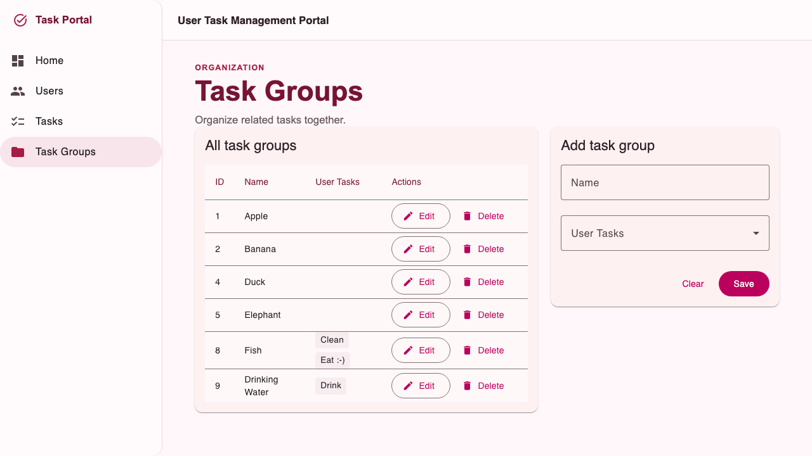

# User Task Management

User Task Management is a single-page application for organizing users, tracking work, and grouping related tasks. The Angular 22 frontend is served by an ASP.NET Core 10 backend and stores development data in SQLite.

## Features

- Dashboard with links to the main management areas.
- Angular Material interface with a custom rose-and-red theme, responsive sidenav navigation, accessible focus states, and mobile layouts.
- User management with create, edit, list, and delete workflows.
- Task management with owners, deadlines, statuses, and optional task groups.
- Task-group management with name and task membership editing.
- Versioned REST API under `/api/v1`.
- Health endpoint at `/health` for deployment and CI readiness checks.

## Screenshots

### Dashboard



### Users



### Tasks



### Task groups



## Architecture

```text
Angular standalone components
        │ HttpClient /api/v1
ASP.NET Core 10 REST controllers
        │ async services and DTOs
Entity Framework Core 10
        │
SQLite (blog.db by default)
```

The Angular client uses standalone Angular components and Angular Material for
navigation, cards, tables, forms, selects, icons, loading states, and error
states. Bootstrap is not used by the client.

The explicit relationship is `UserTask.UserId` → `User` and optional `UserTask.TaskGroupId` → `TaskGroup`. Users cannot be deleted while tasks reference them; task groups cannot be deleted while they contain tasks.

## Prerequisites

- Node.js 26 and npm
- .NET 10 SDK
- Chromium for Playwright browser tests

### Native macOS setup with Homebrew

Homebrew provides the required .NET 10 SDK:

```bash
brew install dotnet
export DOTNET_ROOT="$(brew --prefix)/opt/dotnet/libexec"
```

Set `DOTNET_ROOT` in your shell profile if you want it to persist between
terminal sessions. Node.js 26 is already available through Homebrew as
`node@26`/`node`.

## Run locally

```bash
./start.sh
```

The development app is available through the ASP.NET Core host. Configure the database with `ConnectionStrings:DefaultConnection`; the default is `Data Source=blog.db`. The database is disposable development data and can be recreated by deleting `blog.db` and starting the app with the fresh EF migration.

## API

| Method | Endpoint | Purpose |
| --- | --- | --- |
| GET, POST | `/api/v1/users` | List or create users |
| GET, PUT, DELETE | `/api/v1/users/{id}` | Read, update, or delete a user |
| GET, POST | `/api/v1/tasks` | List or create tasks |
| GET, PUT, DELETE | `/api/v1/tasks/{id}` | Read, update, or delete a task |
| GET, POST | `/api/v1/task-groups` | List or create task groups |
| GET, PUT, DELETE | `/api/v1/task-groups/{id}` | Read, update, or delete a task group |
| GET | `/api/v1/task-groups?sort=name` | Sort groups by name |
| GET | `/api/v1/task-groups?sort=taskCount` | Sort groups by task count |
| GET | `/health` | Application readiness check |

Creates return `201`, updates return `200`, successful deletes return `204`, missing resources return `404`, invalid requests return `400` ProblemDetails, and relationship conflicts return `409`.

## Verification commands

```bash
cd ClientApp
npm run lint
npm test
CI=1 NG_BUILD_MAX_WORKERS=1 npm run build -- --configuration production
npm run e2e:install
npm run e2e
```

```bash
dotnet restore UserTaskManagement.sln
dotnet build UserTaskManagement.sln --configuration Release
dotnet test UserTaskManagement.sln --configuration Release
dotnet publish user-task-management.csproj --configuration Release
```

### Podman verification

The repository includes a multi-stage `Containerfile`. Its build runs the
Angular production build, .NET restore, .NET Release build, and backend tests.
Playwright remains a separate CI check because the container workflow does not
install or run Chromium.

On macOS, install and start Podman's Linux VM once:

```bash
brew install podman
podman machine init
podman machine start
```

Build the application and run the local verification stages:

```bash
podman build --tag user-task-management:local .
```

Run the resulting published application, if needed:

```bash
podman run --rm --publish 5000:8080 user-task-management:local
```

The application is then available at `http://127.0.0.1:5000`.

## GitHub Actions

`.github/workflows/ci.yml` runs on pushes and pull requests. It installs Node.js 26 and .NET 10, runs frontend lint/unit tests and the production build, runs backend tests, publishes the application, starts the published output, checks `/health`, and runs Playwright against that published app. Build output, TRX files, Playwright traces, screenshots, and reports are uploaded as workflow artifacts when available.

## Development notes

- Frontend styling is defined in `ClientApp/src/styles.scss`; the Material theme
  uses rose as its primary palette and red as its tertiary palette.
- The client keeps CRUD forms inline and uses Material tables and form controls;
  no dialog-based editing workflow is required.
- The API redesign intentionally removes the legacy `/User`, `/UserTask`, and `/TaskGroup` routes.
- SQLite is the default development and test database; use a separately managed database for production deployments.
- The application currently has no authentication or authorization layer.
- The `Containerfile` provides a local Podman build and verification workflow;
  Playwright browser tests continue to run in CI.
